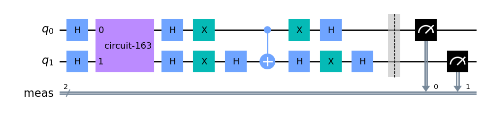
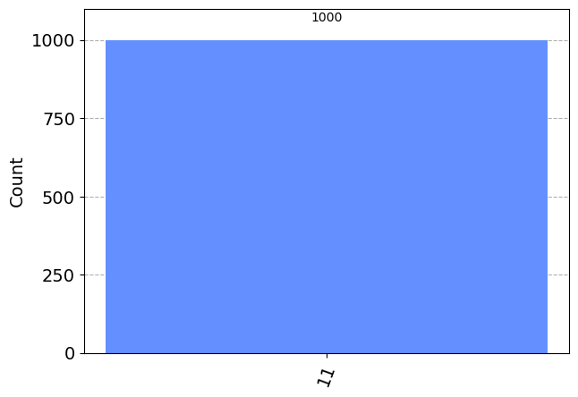
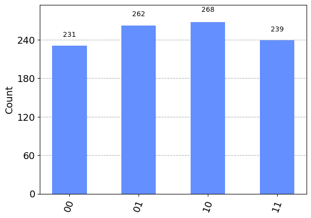
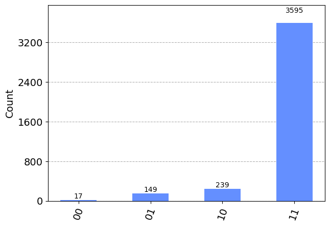

# Finding negative number
The task was to create a quantum circuit that finds the negative number in a list of integers. 
Example 
```
A = find_negative_numbers([1,-3,2,15])
print(A)
“True”

B = find_negative_numbers([1,4,8,11])
print(B)
“False”
```
In the file Find_negative_number.ipynb I created a Grover circuit for two qubits that has a dynamically variable oracle depending on the list. If it receives a list with negative number as input the oracle will consit of a Controlled Z (CZ) gate othewise it is trivial. The oracle in this way marks the $\ket{11}$ state if there is a negative number otherwise it does not mark any state. The oracle would be more compleceted if not only the sign but also the membership of the negative number would be part of the question. 
There are two type of oracles that I implemented.
1. One of them gets an input of the transformation of an integer list into a list of the 2's complement binary representation of the integers and looks for the first element of the bitstrings where the sign of the integers is encoded ("1" for - and "0" for +). In this way the size of the numbers in the list is limited to the size of the binary representation. Therefore an overflow could occur when running the code, e.g. for the 8-bit 2's complement representation it will give the following result:
```True (there is at least one negative integer in the list [1, 2, 3, 6, 2, 1, 128])```.
This is clearly wrong so the binary representation should be set to a higher value where 128 can be correctly represented.
2. The other type of oracle receives an input where the list of integers transformed into a binary list depending on their signs (1: negative and 0: positive). The oracle then works just like in the above case: applies a CZ gate if it finds a 1 in the list and remains trivial otherwise. This makes the algorithm independent of the binary representation bit size.
The drawing of the circuit:
<p align="center">

  
Running a circuit on a simulator gives us the following results: 
* if there is a negative number in the list then the measurment gives the most counts to the state $\ket{11}$ (in our case we set the number of shots to 1000 and all of them came out as $\ket{11}$):
  
<p align="center">

  
* if there is no negative number in the list then all possible states got circa the same amout of measurement counts:
  
<p align="center">


This will change if we run the algorithm on a real quantum computer: the complete accumulation of the counts on $\ket{11}$ disappeares due to noise. However still a sharp peak is present for $\ket{11}$ indicating the negative number:

<p align="center">


### Remark
This is not an ideal problem for  the Gorver algorithm since already the encoding of the integers is of order $O(N)$ so the adventage of the Grover algorithm's $ O(\sqrt{N})$ cannot be exploited.
