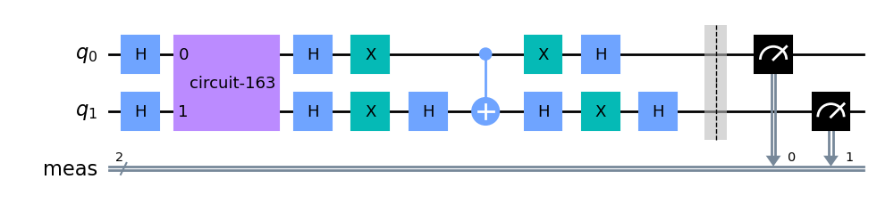
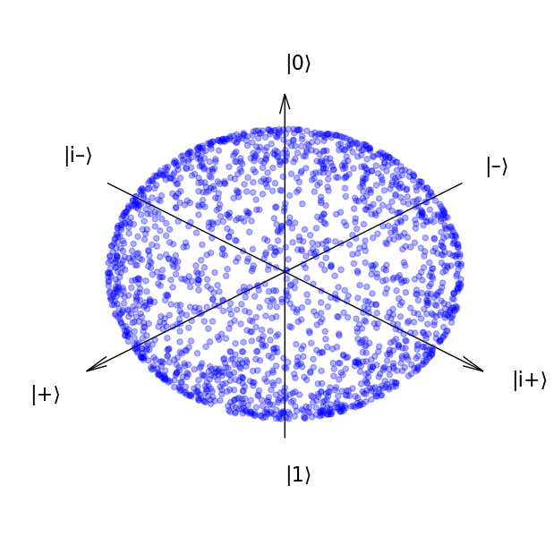

# Quantum_Computing
Quantum computing related small projects, tutorials and didactic notes.

QOSF:
Assignment for the Quantum Open Source Foundation by which I got accepted to cohort 8 in 2023-2024.

HUB:
Haar measure, Unitary designs and Barren plateaus
Some tutorials and explaining materials mostly inspired from PennyLane tutorials and related articles.

